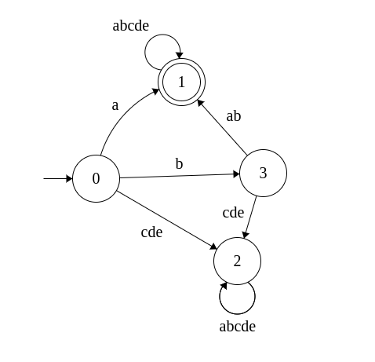

### Придумать язык для описания конечных автоматов. Привести описание этого языка на естественном языке. Привести три файла, описывающих какие-нибудь автоматы на вашем языке.

Сначала задаем Алфавит, затем перечисляем переходы. Оформление:
```cpp
// Алфавит заключен в {} и символы перечисляются через робел. 
// Имена символов и состояний могут содержать только латинские буквы и цифры
{a1 a2 a3 a5 a6 a7 a8}
// Терминальное состояние q  обозначается
(q)
// начальное состояние q. Оно может быть только одно, поэтому однозначно сопоставим ему символ
@
// Переходы перечисляются построчно и оформляются так:
/* первое состояние->(символы, по которым можно перейти во второе состояние, перечисление пробел)-> второе состояние */
@->{a1 a2}->(q2) // переход из начальной вершины в терминальную
q1->{a7 a8}->q1
```
### Примеры
Есть автоматы, заданные графами:


На моем языке:
```cpp
{a1 a2 a3}
(@)->{a3}->(@)
(@)->{a1 a2}->q1
q1->{a2 a3 a1}->q1
```


```cpp
{0, 1}
@->{0}->(1)
@->{1}->(2)
(1)->{1}->(2)
(2)->{0}->(1)
```


```cpp
{a b c d e}
@->{a}->(1)
@->{b}->3
@->{c d e}->2
(1)->{a b c d e}->(1)
3->{a b}->(1)
3->{c d e}->2
2->{a b c d e}->2

